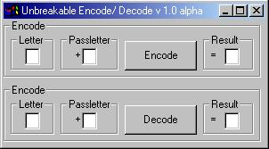



## Unbreakable Encryption

### Description

'this is probably the crappest encryption going here

'i wrote this cause i saw it on descovery channel

'its an encryption that has been used for ages even used

'in wars

'its supposed to use passwords and encode whole

'sentences but i didn't feel like doing that

'i will soon, mabey this weekend

'anyway what this does it gets the ascii code of the

'uppercase letter in text1 and adds the ascii code of

'the uppercase letter in text2 it then subtracts 64 from

'it and converts this to a new character to test draw a

'table similar to this one:

'A|B|C|D|E|F|G|H|I|J ETC. UNTIL Z.

'B|C|D|E|F|G|H|I|J|K

'C|D|E|F|G|H|I|J|K|L

'D

'E

'ETC. UNTIL Z

'YOU GET THE PICTURE

'Now take the word you want to encode say norm and choose

'password say dog . what you do now is go to the 1st

'letter of the password on the top row and the 1st letter

'of the text in the vertical row and move down/across until

'they meet. this is the encoded character. you keep doing

'this until the text is encoded. if the password is at the

'end start at the beginning again.

'to decode do the same as the encryption but now you do

'the password in the vertical side and the text on the

'horizontal side

'tada

'Themba Kriger : wayne_kerr@hushmail.com send me any

'modifications plz! thanx
 
### More Info
 
the password and the text to encrypt decrypt

the encoded decoded text

may cause neasea

             |
---                |---
**Submitted On**   |2000-08-24 20:50:36
**By**             |[Themba Kriger](https://github.com/Planet-Source-Code/PSCIndex/blob/master/ByAuthor/themba-kriger.md)
**Level**          |Intermediate
**User Rating**    |3.8 (15 globes from 4 users)
**Compatibility**  |VB 6\.0
**Category**       |[Encryption](https://github.com/Planet-Source-Code/PSCIndex/blob/master/ByCategory/encryption__1-48.md)
**World**          |[Visual Basic](https://github.com/Planet-Source-Code/PSCIndex/blob/master/ByWorld/visual-basic.md)
**Archive File**   |[CODE\_UPLOAD92718242000\.zip](https://github.com/Planet-Source-Code/themba-kriger-unbreakable-encryption__1-10977/archive/master.zip)

